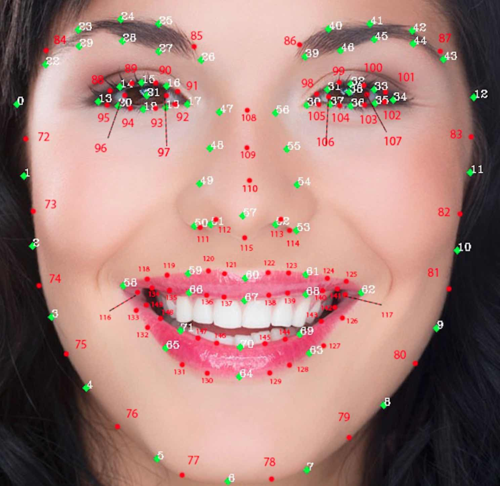
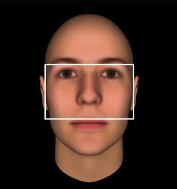

# FacialFeature

## 目录说明

```shell
.
|-- images/：存放待检测图像文件
|-- models/：模型目录
|-- requirments.txt
|-- FaceDetect.py：检测并输出最终数据
```

备注：
* 图像为jpeg/png/jpg格式

## 使用

1. 环境准备
    * python3.8.5
    * pip install -r requirements.txt

2. python FaceDetect.py
    运行结果：生成result文件夹
    ```shell
    result
    |-- images_list.txt     ：images文件夹下的文件列表
    |-- images_failed.txt   ：检测失败的图片文件名和失败原因
    |-- images_result.txt   ：检测成功的人脸结果
    |-- images_keypoints.txt：150个关键点坐标(x,y)
    |-- images_visulaiztion/：检测的可视化结果
    ```
    images_result.txt字段：文件名，偏移量，表情，情绪，人脸长宽比
        文件名：
        偏移量：左/右偏+度数
        表情：none,smile,laugh
        情绪：angry,disgust,fear,happy,sad,surprise,neutral,pouty,grimace
        人脸长宽比：此处计算的长宽比是不准确的

    keypoints:
    
    
    长宽比计算基准：
    

## 图片准备建议

1. 每张照片含有1个人脸
0. 裁减时不必严格至准确外接人脸，但人脸的背景应当简单
0. 脸要正
0. 光线良好
0. 清晰度良好。以当前ESIEC拍全身照的标准，人脸清晰度实际上不好。这种清晰度计算长宽比足够，但
